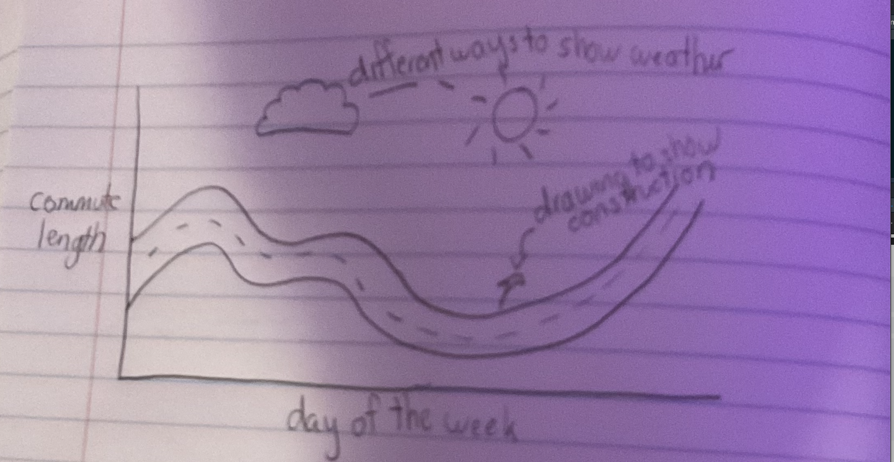
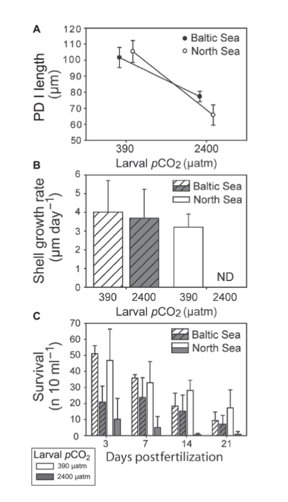

##Set Up

```{r}
#| label: reading-packages
#| message: false
# reading in packages
library(tidyverse)
library(here)
library(janitor)
library(readxl)
```

```{r}
#| label: data-set-up
#| message: false
#| warning: false
# creating object for kelp data
kelp <- read_csv("temp-kelp.csv")
# creating object for personal data
commute <- read_csv("envs193ds-personal_data - Sheet1.csv")
```

## Problem 1

### a.

The two tests that we should run to determine the relationship between temp. and giant kelp elongation rate would be a Pearson correlation test and a Spearman rank test. The tests both measure the strength of the relationship between the variables but the Pearson test relies on a normal and linear distribution and the Spearman test does not need normal distribution.

### b.

```{r}
#| label: problem-1b
# base layer ggplot
ggplot(kelp, mapping = aes(x = temp_c, y = kelp_elong)) + 
  # first layer: scatter plot
  geom_point(color = "blue") + 
  # second layer: line of best fit + ribbon
  geom_smooth(method = "lm", se = TRUE, color = "darkblue") +
  # renaming x and y axis
  labs(x = "Temperature (C)", y = "Kelp Frond Elongation Rate (cm/day)") + 
  # changing the theme of the graph to classic
theme_classic()
```

### c.

#### Checking assumptions

Linear = yes the data does have a linear relationship. You can see this in problem 1b where the linear graph is the right model for the data.

Normality = Yes the data is normally distributed, this is shown through the Shapiro test.

Based on these two assumption checks the correct test to run would be the Pearson correlation test.

```{r}
#| label: checking-normality
shapiro.test(kelp$temp_c) # running normality test for temp
shapiro.test(kelp$kelp_elong) # running normality test for kelp growth rate
```

#### running the test

```{r}
# running the correlation test
cor.test(kelp$temp_c, # setting first variable
         kelp$kelp_elong, # setting 2nd variable
         method = "pearson") # setting the method to be Pearson
```

### d.

In order to test the strength of the relationship between temperature in Celcius and kelp frond elongation rate in cm/yr I used a Pearson test of correlation (r(30) = -0.687, p = 1.36 x 10^-5^, $\alpha$ = 0.05, CI = (-0.85, -0.45)). This test was ran because the data was normally distributed and showed a linear relationship. This test yielded a value of r = -0.69, which shows a moderate, negative linear correlation between variables. Because of this value and the p value being less than 0.05 we can safely reject the null hypothesis on the grounds of there being a negative correlation between the variables.

### e.

The results seem to show that the increasing temperature of the ocean may cause kelp growth rates to slow down, which would in turn have larger effects on the kelp's overall health. When the kelp was grown in warmer temperatures the kelp grew at a slower rate. The relationship is represented by a value of -0.69 which means that there is a moderately strong, negative correlation between temperature and elongation rate.

### f.

```{r}
#| label: spearman-test
#| warning: false
# setting up the correlation test
cor.test(kelp$temp_c, # setting first variable
         kelp$kelp_elong, # setting 2nd variable
         method = "spearman") # assigning spearman test
```

Through running a Spearman rank test ($\rho$ = -0.69, p = 1.29 x 10^-5^, $\alpha$ = 0.05) I determined that there is a strong negative relationship between temperature and frond elongation rates. The two tests have both led me to reject the null hypothesis of there being no correlation between variables because they both show a negative relationship between the increasing temperature and decreased growth rates. The Spearman test tested without normality and found there is a negative relationship, and the Pearson test used normality and also found a negative, linear relationship.

## Problem 2.

```{r}
#| label: creating-summary
commute_summary <- commute |>
  clean_names() |> 
# grouping by categorical variable
group_by(day_of_the_week) |>
# calculating mean and sd
summarize(
mean = mean(commute_length_min),
sd = sd(commute_length_min))
```

```{r}
#| label: cleaning-columns
# creating object to clean column names
commute <- commute|> 
  # removing spaces and parentheses in column names
  clean_names()
```

```{r}
#| label: plot-1
# base layer: ggplot
ggplot(data = commute,

# assigning x = days of the week, y = commute length
mapping = aes(x = day_of_the_week,
              y = commute_length_min,
              color = day_of_the_week)) +

# first layer: jitter
geom_jitter(height = 0,
            alpha = 0.5,
            width = 0.5) +

# second layer: point range
geom_pointrange(data = commute_summary,

# assigning the values of mean and sd
mapping = aes(x = day_of_the_week,
              y = mean,
              ymax = mean + sd,
              ymin = mean - sd)) +

# labeling axis and title
labs(x = "Day of the week",
     y = "Commute Length in Minutes",
     title = "Comparing Commute Length by Days of the Week",
     subtitle = "Most recent observation = 05/22") +

# changing theme
theme_classic() +

# removing legend
theme(legend.position = "none") +

# changing color
scale_color_manual(values = c("lightblue",
                              "lightpink",
                              "lightgreen"))
```

```{r}
# base layer: ggplot
ggplot(data = commute,
# assigning x and y axis
mapping = aes(x = time_of_day_hr_min ,
y = commute_length_min)) +
# adding in the data points and coloring
geom_point(color = "forestgreen") +
# changing axis labels and adding titles
labs( x = "Time of Day in Minutes",
y = "Commute Length in Minutes",
title = "Commute Length Compared to Time of Day", 
subtitle = "Most recent observation = 05/22") + 
# retheming
theme_classic()
```

### b.

Plot 1. Jittered plot showing the mean and standard deviation for commute length depending on the day of the week, Light blue data points represent Friday commutes, pink represents Monday, and green represents Wednesday. The Monday and Wednesday commutes have a higher mean length than the Friday data. Each jittered point represents a specific data point, and the large points and error bars represent the mean and standard deviations for each day. Plot 2. Scatterplot depicting relationship between time of day and commute length in minutes. Each point shows a single data point representing a commute length. The plot shows that as the time increases, the length of the commute decreases, showing a negative relationship between time of day and commute length in minutes.

## Problem 3.

### a.

An affective visualization could show how the commute feels based on day of the week, construction, and weather. I could show how these factors can affect the actual commute length but also how it feels, like if some things contribute to a more peaceful or stressful drive. I will use colors and different patterns to show how these affect the drive.

### b.



### c.


### d.

Content: This piece is going to show the graph of the day of the week versus the commute time but represented as a winding road, which will be the line graph connecting the data points. Then, I plan to add elements of the other factors that effect the drive, like weather and construction to make the whole thing look like a map.

Influence: I want this to look like a map but also similar to a cartoonish drawing. I also took influence from the Jill Pelto piece where the graph is painted as an ocean with a ship on it because I think that making the data into a real world item that applies to the context of the data is really attention grabbing.

Form: The form of the piece is going to be a painting on paint paper. The orugh draft is a digital version of what I will paint once I've ironed out the details.

Process: I created the work by first looking at the original graph and then drawing a road that aligned with the points. Then I added in the elements of road signs and weather conditions.

This piece is a painting of a graph of my drive to work at different times of the day turned into a road, combined with the factors that affect the quality of the drive, including weather and construction. This is influenced by road maps and the Jill Pelto piece "Surveying Above and Below the Surface" where she depicted an ocean temperature graph as an ocean with a boat above it. This was created by outlining the shape of the graph as a road and then combining that with the other components of what effects a commute.

### e.

[Slideshow](https://docs.google.com/presentation/d/1R8AbmCVOQoLEJQU__OdJY-zZR1jP2V1eZOjl1CaK64w/edit?usp=sharing)

## Problem 4

### a.

The test that the authors are running is an ANOVA test. This test adresses their main question by seeing the variance between the groups in different treatments. They compared the mean responses to the different treatments. If it is found to be significant (P \< 0.05), then the null can be rejected.



### b.

The authors show their statistics in the top graph by showing the larval pCO~2~ on the x axis and PDI length on the y axis. The graph shows the PDI length (micro-m) at 2 pCO~2~ levels (about 390 and 2400 micro-atm) with mean values and SE. The underlying data is not shown for the calculations which makes it a little less clear of what the true data looks like. But nevertheless the overall effect is clear, with the higher pCO~2~ having significantly less length than the the lower levels.

### c.

There is very little visual clutter in the graphs. There are no gridlines on the figure which makes the data very easy to see, and the legends are very minimal and do not take up much space. The data to ink ratio in. my opinion is very good, you can see enough information to understand what is being depicted but there is not so much so that you cannot see what is being shown.


### d.
